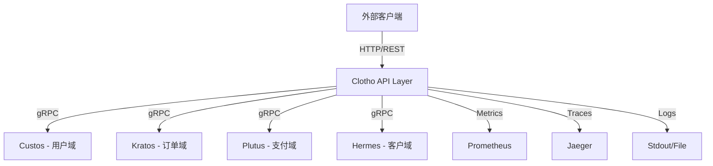

# Clotho (API Orchestration Layer)

**Clotho** 源自希腊神话中的命运三女神之一，她负责纺织命运之线。
在本项目中，Clotho 承担着 **API 层编排者** 的角色：
它接收外部请求，调用 Custos（用户域）、订单域、支付域等领域服务，
并将结果统一对外暴露，成为系统的「对外之线」。

---

## 🎯 定位

- **不是网关**：Clotho 不负责限流、熔断、流量控制，这些交给 API Gateway 或 Service Mesh。
- **不是领域服务**：Clotho 不维护业务数据，所有领域逻辑都在 Custos/Orders/Billing 等服务中。
- **是编排层**：负责请求转发、聚合、统一对外接口。

---

## 🏗️ 架构边界

- **输入**：HTTP/REST API，对外提供业务接口。
- **输出**：通过 gRPC 调用内部领域服务（Custos/Orders/...）。
- **职责**：
  - 请求解析与路由
  - 使用 Mora 的 Auth 中间件校验 Access Token
  - 调用 Custos 完成用户认证/鉴权
  - 调用其他领域服务完成业务编排
  - 聚合结果，返回标准化响应

---

## 📂 项目结构

```
clotho/
├── cmd/
│   ├── root.go             # Cobra CLI 根命令
│   ├── serve.go            # 启动服务命令
│   └── version.go          # 版本信息命令
├── configs/
│   ├── clotho.yaml         # 主配置文件
│   └── clotho.env.yaml     # 环境变量配置
├── internal/
│   ├── application/
│   │   └── usecase/        # API 调用编排逻辑
│   │       └── user_proxy.go
│   ├── infrastructure/
│   │   ├── client/         # gRPC 客户端
│   │   │   └── custos_grpc.go
│   │   └── http/           # 对外 HTTP API
│   │       ├── handler/    # HTTP 处理器
│   │       │   ├── user.go
│   │       │   ├── profile.go
│   │       │   ├── health.go
│   │       │   └── monitoring.go
│   │       └── router.go   # 路由配置
│   ├── middleware/
│   │   ├── auth.go         # JWT 认证中间件
│   │   ├── logging.go      # 日志中间件
│   │   ├── metrics.go      # 指标收集中间件
│   │   ├── rate_limiter.go # 限流中间件
│   │   ├── circuit_breaker.go # 熔断中间件
│   │   ├── cors.go         # CORS 中间件
│   │   └── error.go        # 错误处理中间件
│   └── validation/
│       └── profile.go      # 请求参数校验
├── docs/
│   ├── API.md             # API 详细文档
│   ├── STRUCTURE.md       # 项目架构文档
│   ├── OBSERVABILITY.md   # 可观测性指南
│   ├── swagger.yaml       # API 文档
│   ├── swagger.json       # API 规范
│   ├── doc.go             # Swagger 元数据
│   └── docs.go            # Swagger 生成器
├── main.go                 # 应用入口
├── Makefile                # 构建工具
└── go.mod
```

---

## 🚦 请求流转

1. 外部客户端调用 Clotho 的 HTTP API
2. Clotho 使用 **Mora Auth Middleware** 验证 Access Token
3. 根据路由，Clotho 调用 Custos/Orders 等服务（gRPC）
4. 聚合结果 → 返回 HTTP 响应

---

## 🔑 关键特性

### 核心能力

- **统一 API 入口**：对外隐藏内部服务细节
- **高性能通信**：内部使用 gRPC 调用
- **服务解耦**：Custos 专注领域逻辑，Clotho 专注编排
- **完整的可观测性**：集成 OpenTelemetry 链路追踪和指标收集

### 中间件支持

- **JWT 认证**：基于 Mora Auth 中间件的 Token 校验
- **限流保护**：全局限流 + IP 限流 + 用户限流
- **熔断器**：防止级联故障，提供降级能力
- **指标收集**：Prometheus 格式的实时指标
- **CORS 支持**：跨域请求处理
- **日志追踪**：结构化日志 + TraceID 关联

---

## 🌐 API 端点

### 公开端点

| Method | Path | Description |
|--------|------|-------------|
| GET | `/health` | 健康检查 |
| GET | `/swagger/*any` | API 文档 (Swagger UI) |
| GET | `/metrics` | Prometheus 指标 |

### 认证端点 (需要 JWT Token)

| Method | Path | Description |
|--------|------|-------------|
| GET | `/api/v1/users/me` | 获取当前用户信息 |
| GET | `/api/v1/users/:id` | 获取指定用户信息 |
| GET | `/api/v1/profile/` | 获取当前用户完整资料 |
| PUT | `/api/v1/profile/` | 更新当前用户资料 |
| PUT | `/api/v1/profile/preferences` | 更新用户偏好设置 |
| GET | `/api/v1/profile/users/:id` | 获取其他用户公开资料 |

### 监控端点 (需要 JWT Token)

| Method | Path | Description |
|--------|------|-------------|
| GET | `/api/v1/monitoring/stats` | 获取所有中间件统计 |
| GET | `/api/v1/monitoring/rate-limiter` | 获取限流器统计 |
| GET | `/api/v1/monitoring/circuit-breaker` | 获取熔断器统计 |
| POST | `/api/v1/monitoring/circuit-breaker/reset` | 重置熔断器 |

---

## ⚙️ 配置说明

### 服务器配置

```yaml
server:
  port: "8080"              # HTTP 服务端口
  host: "0.0.0.0"           # 监听地址
  read_timeout: 30s         # 读取超时
  write_timeout: 30s        # 写入超时
  idle_timeout: 60s         # 空闲连接超时
```

### JWT 配置

```yaml
jwt:
  secret: "your-jwt-secret-key-change-in-production"
  access_token_ttl: 15m
  refresh_token_ttl: 24h
```

### gRPC 服务配置

```yaml
services:
  custos:
    address: "localhost:9001"
    timeout: 30s
    max_retries: 3

  orders:
    address: "localhost:9002"
    timeout: 30s
    max_retries: 3
```

### 限流配置

```yaml
rate_limiter:
  global_rps: 1000.0        # 全局每秒请求数
  global_burst: 2000        # 全局突发容量
  per_ip_rps: 10.0          # 单 IP 每秒请求数
  per_ip_burst: 20          # 单 IP 突发容量
  per_user_rps: 100.0       # 单用户每秒请求数
  per_user_burst: 200       # 单用户突发容量
  cleanup_interval: "5m"    # 清理间隔
  max_idle_time: "10m"      # 最大空闲时间
```

### 熔断器配置

```yaml
circuit_breaker:
  max_requests: 5           # 半开状态最大请求数
  interval: "60s"           # 统计周期
  timeout: "30s"            # 超时时间
  failure_threshold: 5      # 失败次数阈值
  failure_ratio: 0.6        # 失败率阈值
  min_requests: 10          # 最小请求数
```

### 可观测性配置

```yaml
observability:
  service_name: "clotho"
  exporter_url: "http://localhost:4317"
  sample_ratio: 1.0

  metrics:
    enabled: true
    prometheus:
      enabled: true
      endpoint: "/metrics"
      port: "9090"

  tracing:
    enabled: true
    jaeger:
      enabled: true
      endpoint: "http://localhost:14268/api/traces"
```

---

## 🚀 快速开始

### 前置要求

- Go 1.25+
- Docker (可选，用于容器化部署)
- Custos 服务运行中 (gRPC 端口 9001)

### 本地开发

```bash
# 克隆项目
cd fly/clotho

# 安装依赖
make init-deps

# 启动开发服务器 (热重载)
make dev

# 或构建后运行
make build
make run
```

### 使用 Docker

```bash
# 构建镜像
make docker-build

# 启动服务
make docker-run

# 查看日志
make docker-logs

# 停止服务
make docker-stop
```

### 验证服务

```bash
# 健康检查
curl http://localhost:8080/health

# 查看 API 文档
open http://localhost:8080/swagger/index.html

# 查看指标
curl http://localhost:8080/metrics

# 查看完整文档
# API 文档: http://localhost:8080/swagger/index.html
# 架构文档: ./docs/STRUCTURE.md
# 可观测性指南: ./docs/OBSERVABILITY.md
```

---

## 🧪 测试

```bash
# 运行所有测试
make test

# 运行 Lint 检查
make lint

# 查看测试覆盖率
# 测试完成后会生成 coverage.html
open coverage.html
```

---

## 📊 可观测性

### 指标监控

Clotho 暴露以下 Prometheus 指标：

- `http_requests_total` - HTTP 请求总数（按方法、路径、状态码分类）
- `http_request_duration_seconds` - HTTP 请求延迟（直方图）
- `http_requests_in_flight` - 当前正在处理的请求数
- `rate_limiter_rejected_total` - 被限流拒绝的请求数
- `circuit_breaker_state` - 熔断器状态（0=关闭, 1=半开, 2=打开）
- `circuit_breaker_requests_total` - 熔断器拦截的请求数

访问 `http://localhost:8080/metrics` 查看完整指标。

### 链路追踪

所有请求自动注入 TraceID 和 SpanID，可在 Jaeger UI 中查看：

- 访问 `http://localhost:16686`
- 搜索服务名称 `clotho`
- 查看完整的调用链路

### 日志

结构化日志输出，包含以下字段：

- `timestamp` - 时间戳
- `level` - 日志级别
- `msg` - 日志消息
- `trace_id` - 链路追踪 ID
- `method` - HTTP 方法
- `path` - 请求路径
- `status` - 响应状态码
- `latency` - 请求延迟

---

## 🔌 集成示例

### 调用用户资料接口

```bash
# 获取 JWT Token (从 Custos 登录)
TOKEN=$(curl -X POST http://localhost:8081/api/v1/auth/login \
  -H "Content-Type: application/json" \
  -d '{"username":"admin","password":"password"}' \
  | jq -r '.data.access_token')

# 通过 Clotho 获取用户资料
curl -X GET http://localhost:8080/api/v1/profile/ \
  -H "Authorization: Bearer $TOKEN"

# 更新用户资料
curl -X PUT http://localhost:8080/api/v1/profile/ \
  -H "Authorization: Bearer $TOKEN" \
  -H "Content-Type: application/json" \
  -d '{
    "nickname": "新昵称",
    "avatar": "https://example.com/avatar.jpg",
    "bio": "这是我的个人简介"
  }'
```

### 查看中间件统计

```bash
# 获取所有中间件统计
curl -X GET http://localhost:8080/api/v1/monitoring/stats \
  -H "Authorization: Bearer $TOKEN"

# 获取限流器统计
curl -X GET http://localhost:8080/api/v1/monitoring/rate-limiter \
  -H "Authorization: Bearer $TOKEN"

# 重置熔断器
curl -X POST http://localhost:8080/api/v1/monitoring/circuit-breaker/reset \
  -H "Authorization: Bearer $TOKEN"
```

---

## 🚀 实现状态

### ✅ 已完成 (95%)

#### 核心功能
- ✅ HTTP 服务器和路由配置
- ✅ Cobra CLI 命令行工具
- ✅ 配置文件加载 (YAML + ENV)
- ✅ Swagger API 文档

#### 中间件
- ✅ JWT 认证中间件
- ✅ 日志中间件
- ✅ CORS 中间件
- ✅ 限流中间件 (全局 + IP + 用户)
- ✅ 熔断器中间件
- ✅ 指标收集中间件
- ✅ 错误处理中间件

#### 编排层
- ✅ 用户代理服务 (UserProxy)
- ✅ gRPC 客户端 (Custos)
- ✅ 用户资料处理器
- ✅ 监控统计处理器

#### 可观测性
- ✅ OpenTelemetry 集成
- ✅ Prometheus 指标
- ✅ Jaeger 链路追踪
- ✅ 结构化日志

#### 部署
- ✅ Dockerfile
- ✅ docker-compose.yml
- ✅ Makefile 构建工具

### 🔧 待完善 (5%)

- ⏳ 订单服务代理 (OrderProxy)
- ⏳ 支付服务代理 (PaymentProxy)
- ⏳ 集成测试覆盖
- ⏳ 性能压测报告

---

## 🔄 模块交互图



---

## 📋 开发约定

1. **所有领域逻辑由对应服务实现**：Clotho 只做请求转发和聚合
2. **使用 gRPC 调用内部服务**：高性能、类型安全
3. **统一错误处理**：使用标准错误码和错误信息格式
4. **完整的链路追踪**：所有请求都携带 TraceID
5. **防御性编程**：限流、熔断、超时保护
6. **API 版本控制**：使用 `/api/v1` 前缀

---

## 🔮 下一步

- 实现订单服务和支付服务的代理逻辑
- 增加 GraphQL 支持
- 集成 Service Mesh (Istio/Linkerd)
- 补充更多集成测试
- 完善监控和告警规则
- 添加 API 限流策略配置界面

---

## 🤝 贡献指南

参考项目根目录的贡献指南，遵循统一的代码规范和提交规范。

---

## 📄 许可证

本项目采用 Apache 2.0 许可证 - 查看 [LICENSE](../LICENSE) 文件了解详情。

---

## 🔗 相关服务

- [Custos - 认证授权服务](../custos/README.md)
- [Kratos - 订单服务](../kratos/README.md)
- [Plutus - 支付钱包服务](../plutus/README.md)
- [Hermes - 客户服务](../hermes/README.md)
- [Mora - 基础框架](../mora/README.md)
