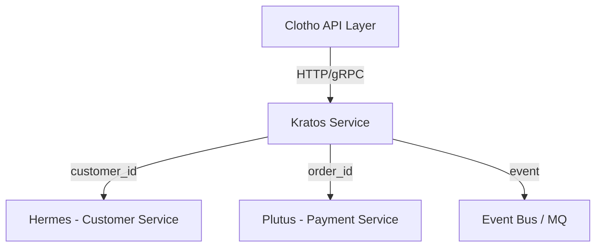

# Kratos (Order Service)

**Kratos** is the Order Service Base for the Fly platform.  
Symbolizing order and execution, it manages the order lifecycle and serves as the central node in the transaction chain.

---

## Context

- **Mora** → capability library (config, logger, db, cache, mq, utils)  
- **Clotho** → API orchestration layer (entry point, trust/zero trust, request routing)  
- **Kratos (Order Domain)** → owns order lifecycle, state management, and audit trails  
- **Hermes** → Customer Service (provides customer information via customer_id)  
- **Plutus** → Payment Service (handles payment processing via order_id)

---

## Kratos Responsibilities

### 1. Order Lifecycle Management

- Order creation with multi-item support  
- Order state machine (pending → paid → fulfilled/canceled)  
- Order cancellation and refund initiation  
- Order fulfillment tracking  

### 2. Order Data Management

- Order master data (order number, customer ID, status, amount)  
- Order items (one-to-many relationship)  
- Order status audit logs  
- Multi-tenant data isolation  

### 3. State Machine & Audit

- Strict order state transition control  
- Complete status change audit trails  
- State validation and business rules  
- Historical state tracking  

### 4. API Integration

- REST API endpoints for order operations  
- gRPC service for internal communication  
- JWT-based authentication (via Clotho/Custos)  
- Tenant context resolution  

### 5. External Service Integration

- Customer data reference (via Hermes customer_id)  
- Payment processing coordination (via Plutus order_id)  
- Event publishing for order state changes  
- Cross-service data consistency  

### 6. Observability & Monitoring

- Order operation metrics  
- State transition tracking  
- Performance monitoring  
- Error tracking and alerting  

---

## Out of Scope

The Order Domain **does not handle**:  

- Payment processing (handled by Plutus)  
- Customer information management (handled by Hermes)  
- Inventory management  
- Product catalog management  
- Infrastructure capabilities (logging, config, db, mq → handled by Mora)  

---

## Database Schema (MySQL)

See `configs/migrations/001_init_kratos.sql` for complete DDL.

### orders

```sql
CREATE TABLE orders (
    id BIGINT PRIMARY KEY AUTO_INCREMENT,                    -- Order ID, primary key
    order_number VARCHAR(64) UNIQUE NOT NULL,                -- Order number (business key)
    customer_id BIGINT NOT NULL,                             -- Customer ID (reference to Hermes)
    tenant_id BIGINT NULL,                                   -- Tenant ID (multi-tenancy)
    status ENUM('pending','paid','fulfilled','canceled')     -- Order status
           DEFAULT 'pending',
    total_amount DECIMAL(15,2) NOT NULL,                     -- Total order amount
    currency VARCHAR(3) DEFAULT 'USD',                       -- Currency code
    created_at DATETIME DEFAULT CURRENT_TIMESTAMP,           -- Creation time
    updated_at DATETIME DEFAULT CURRENT_TIMESTAMP
               ON UPDATE CURRENT_TIMESTAMP,                  -- Update time
    deleted_at DATETIME NULL                                 -- Soft delete timestamp
);
CREATE INDEX idx_orders_customer ON orders(customer_id);
CREATE INDEX idx_orders_tenant ON orders(tenant_id);
CREATE INDEX idx_orders_status ON orders(status);
```

### order_items

```sql
CREATE TABLE order_items (
    id BIGINT PRIMARY KEY AUTO_INCREMENT,                    -- Item ID, primary key
    order_id BIGINT NOT NULL,                                -- Order ID (foreign key)
    product_id VARCHAR(128) NOT NULL,                        -- Product ID (external reference)
    product_name VARCHAR(255) NOT NULL,                      -- Product name
    quantity INT NOT NULL DEFAULT 1,                         -- Quantity
    unit_price DECIMAL(15,2) NOT NULL,                       -- Unit price
    total_price DECIMAL(15,2) NOT NULL,                      -- Total price (quantity * unit_price)
    created_at DATETIME DEFAULT CURRENT_TIMESTAMP,           -- Creation time
    FOREIGN KEY (order_id) REFERENCES orders(id) ON DELETE CASCADE
);
CREATE INDEX idx_order_items_order ON order_items(order_id);
```

### order_status_logs

```sql
CREATE TABLE order_status_logs (
    id BIGINT PRIMARY KEY AUTO_INCREMENT,                    -- Log ID, primary key
    order_id BIGINT NOT NULL,                                -- Order ID (foreign key)
    from_status VARCHAR(32) NULL,                            -- Previous status
    to_status VARCHAR(32) NOT NULL,                          -- New status
    reason VARCHAR(255) NULL,                                -- Status change reason
    operator_id BIGINT NULL,                                 -- Operator ID (user who made the change)
    created_at DATETIME DEFAULT CURRENT_TIMESTAMP,           -- Creation time
    FOREIGN KEY (order_id) REFERENCES orders(id) ON DELETE CASCADE
);
CREATE INDEX idx_order_status_logs_order ON order_status_logs(order_id);
CREATE INDEX idx_order_status_logs_created ON order_status_logs(created_at);
```

---

## Public API Surface (called by Clotho)

### HTTP API

| Path | Method | Description |
|------|--------|-------------|
| `/api/orders` | POST | Create new order |
| `/api/orders/{id}` | GET | Get order details |
| `/api/orders/{id}/items` | GET | Get order items |
| `/api/orders` | GET | List orders (paginated) |
| `/api/orders/{id}/status` | PATCH | Update order status |
| `/api/orders/{id}` | DELETE | Delete order (soft delete) |
| `/health` | GET | Health check |
| `/swagger/*any` | GET | API documentation |

### gRPC API

`OrderService`  

- `CreateOrder` → Create new order with items  
- `GetOrder` → Get order by ID  
- `ListOrders` → List orders with filtering  
- `UpdateOrderStatus` → Update order status with audit  

### Authentication

- JWT tokens injected by Clotho (signed by Custos)  
- User and tenant context resolved in middleware  
- RBAC checks via Casbin integration  

---

## Module Interaction Diagram



---

## Configuration Example

`configs/kratos.yaml`

```yaml
server:
  http_port: 8082
  grpc_port: 9092
database:
  driver: mysql
  dsn: user:password@tcp(mysql:3306)/kratos?charset=utf8mb4&parseTime=True&loc=Local
redis:
  addr: redis:6379
  db: 0
observability:
  service_name: kratos
  endpoint: http://otel-collector:4317
```

---

## Future Roadmap

- Refund and partial refund support (aligned with Plutus)  
- Fulfillment node expansion (shipping/delivery/service completion)  
- Idempotency-Key and event-driven architecture  
- Saga / Outbox pattern for distributed transactions  
- Unified event tracking and replay mechanism  

---

## Development Guidelines

- All requests follow unified response model `{code, message, data}`  
- Error codes centrally defined in `pkg/errors`  
- All database operations through Repository layer  
- All external API calls must carry TraceID  
- Never directly operate DB or Redis in Handler layer  

---

## Project Structure

```text
kratos/
├── cmd/kratosd/main.go           # Application entry point
├── configs/                      # Configuration and migrations
│   ├── kratos.yaml
│   └── migrations/
│       └── 001_init_kratos.sql
├── internal/
│   ├── domain/                   # Domain layer: entities, repository interfaces, domain services
│   ├── application/              # Application layer: use case orchestration
│   ├── infrastructure/           # Infrastructure layer: database, cache, MQ, etc.
│   └── interface/                # Interface layer: HTTP/gRPC
└── pkg/                          # Common components
```

---

## Testing & Deployment

### Local Development

```bash
make run
```

### Unit Testing

```bash
make test
```

### Build Application

```bash
make build
```

### Generate API Documentation

```bash
make swagger
```

### Containerization

```bash
docker build -t fly-kratos .
docker run -p 8082:8082 -p 9092:9092 fly-kratos
```

### Dependencies

- MySQL (database)  
- Redis (cache, optional in config)  
- OpenTelemetry (observability, optional in config)  

---

## 🚀 Current Implementation Status

Kratos service is **fully implemented** with the following features:

### 🏗️ Complete Project Structure

- **Domain Layer**: Order entities, status enums, repository interface definitions  
- **Application Layer**: Order service business logic with complete state machine management  
- **Infrastructure Layer**: GORM database repository implementation  
- **Interface Layer**: HTTP REST API handlers  
- **Common Components**: Error handling, type definitions, constant definitions  

### 📋 API Endpoints (Implemented)

| Path | Method | Description | Status |
|------|--------|-------------|--------|
| `/api/orders` | POST | Create order | ✅ Implemented |
| `/api/orders/{id}` | GET | Get order details | ✅ Implemented |
| `/api/orders/{id}/items` | GET | Get order items | ✅ Implemented |
| `/api/orders` | GET | List orders (paginated) | ✅ Implemented |
| `/api/orders/{id}/status` | PATCH | Update order status | ✅ Implemented |
| `/api/orders/{id}` | DELETE | Delete order | ✅ Implemented |
| `/health` | GET | Health check | ✅ Implemented |
| `/swagger/*any` | GET | API documentation | ✅ Implemented |

### 🧪 Test Coverage

- **Service Layer Tests**: Complete test cases for create, query, update, delete, list operations  
- **HTTP Interface Tests**: Test cases for all API endpoints  
- **Mock Implementation**: Complete repository layer mocks for unit testing  
- **Error Handling Tests**: Duplicate order numbers, invalid state transitions, and other exception scenarios  

### 🔧 Technical Features

- **State Machine Management**: Strict order state transition control  
- **Audit Logging**: Complete status change and operation audit trails  
- **Multi-tenant Support**: Data isolation based on tenant ID  
- **Paginated Queries**: Support for filtering by customer, status, and other conditions  
- **Parameter Validation**: Complete request parameter validation  
- **Error Handling**: Unified error codes and error messages  
- **Swagger Documentation**: Auto-generated API documentation  

### 🚀 Deployment Ready

- All tests passing ✅  
- Code compilation successful ✅  
- Swagger documentation generated ✅  
- Makefile commands complete ✅  
- Configuration templates complete ✅  
