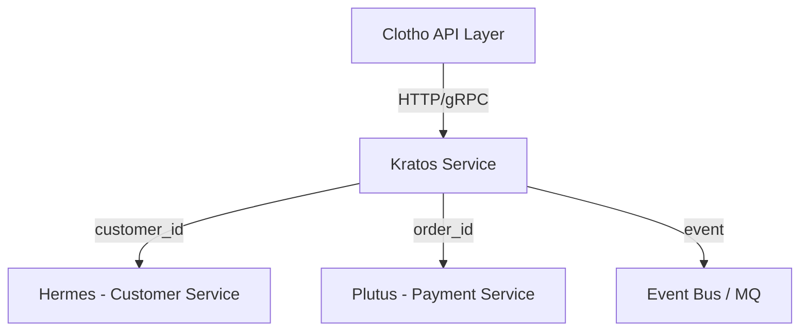

# Kratos (Order Service)

**Kratos** 是 Fly 平台的订单基座服务（Order Service Base）。  
象征秩序与执行，负责订单生命周期管理，是交易链路的中枢节点。

---

## 📌 模块职责与边界

- **负责**：
  - 订单主数据与状态机（pending → paid → fulfilled/canceled）
  - 订单明细（OrderItem）
  - 状态审计与变更日志
  - 与支付（Plutus）、客户（Hermes）的数据关联
- **不负责**：
  - 支付处理（由 Plutus 负责）
  - 客户信息（由 Hermes 负责）
- **边界**：
  - 专注订单本体逻辑：创建、状态流转、查询、审计。
  - 不承担库存、商品、支付职责，仅引用其ID或事件。

---

## 🚀 当前能力

- **订单生命周期管理**：创建、支付、履约、取消。
- **多明细支持**：一单多商品、多类型订单扩展。
- **审计记录**：每次状态变更均落入 `order_status_logs`。
- **API 支持**：REST + gRPC。
- **Mora 能力集成**：
  - config：配置加载
  - logger：结构化日志
  - db：MySQL 驱动封装
  - cache：Redis 缓存
  - observability：OpenTelemetry 链路追踪

---

## 🗄️ 数据库结构说明（MySQL）

详见 `configs/migrations/001_init_kratos.sql`。

| 表名 | 说明 |
|------|------|
| `orders` | 订单主表（含订单号、客户ID、状态、金额等） |
| `order_items` | 订单明细，一对多关系 |
| `order_status_logs` | 状态变更审计日志 |

所有表均支持多租户 `tenant_id` 字段，支持软删除与审计字段。

---

## 🌐 接入方式

### HTTP API
| 路径 | 方法 | 描述 |
|------|------|------|
| `/api/orders` | POST | 创建订单 |
| `/api/orders/{id}` | GET | 查询订单详情 |
| `/api/orders` | GET | 分页查询订单列表 |
| `/api/orders/{id}/status` | PATCH | 更新订单状态 |

### gRPC API
`OrderService`  
- `CreateOrder`  
- `GetOrder`  
- `ListOrders`  
- `UpdateOrderStatus`

### 鉴权
- 通过 Clotho 网关注入的 JWT（由 Custos 验签）
- 在中间件中统一解析 user 与 tenant 上下文

---

## 🔄 模块交互关系



---

## ⚙️ 配置样例

`configs/kratos.yaml`

```yaml
server:
  http_port: 8082
  grpc_port: 9092
database:
  driver: mysql
  dsn: user:password@tcp(mysql:3306)/kratos?charset=utf8mb4&parseTime=True&loc=Local
redis:
  addr: redis:6379
  db: 0
observability:
  service_name: kratos
  endpoint: http://otel-collector:4317
```

---

## 🔭 未来迭代方向

- 支持退款与部分退款（与 Plutus 对齐）
- 履约节点扩展（发货/签收/服务完成）
- 幂等键（Idempotency-Key）与事件驱动架构
- 引入 Saga / Outbox 模式支持分布式事务
- 统一的事件追踪与重放机制

---

## 🧠 开发约定

- 所有请求遵循统一响应模型 `{code, message, data}`
- 错误码集中定义于 `pkg/errors`
- 所有数据库操作通过 Repository 层封装
- 所有外部接口调用必须携带 TraceID
- 严禁在 Handler 层直接操作 DB 或 Redis

---

## 🧩 项目结构

```
kratos/
├── cmd/kratosd/main.go           # 启动入口
├── configs/                      # 配置与迁移
│   ├── kratos.yaml
│   └── migrations/
│       └── 001_init_kratos.sql
├── internal/
│   ├── domain/                   # 领域层：实体、仓储接口、领域服务
│   ├── application/              # 应用层：用例编排
│   ├── infrastructure/           # 基础设施层：数据库、缓存、MQ等
│   └── interface/                # 接口层：HTTP/gRPC
└── pkg/                          # 通用组件
```

---

## 🧪 测试与部署

### 本地运行
```bash
make run
```

### 单元测试
```bash
make test
```

### 构建应用
```bash
make build
```

### 生成 API 文档
```bash
make swagger
```

### 容器化
```bash
docker build -t fly-kratos .
docker run -p 8082:8082 -p 9092:9092 fly-kratos
```

### 依赖服务
- MySQL（数据库）
- Redis（缓存，配置中可选）
- OpenTelemetry（可观测性，配置中可选）

---

## ✅ 当前实现状态

Kratos 服务已**完全实现**，包含以下功能：

### 🏗️ 完整的项目结构
- **领域层**：订单实体、状态枚举、仓储接口定义
- **应用层**：订单服务业务逻辑，包含完整的状态机管理
- **基础设施层**：GORM 数据库仓储实现
- **接口层**：HTTP REST API 处理器
- **通用组件**：错误处理、类型定义、常量定义

### 📋 API 端点（已实现）
| 路径 | 方法 | 描述 | 状态 |
|------|------|------|------|
| `/api/orders` | POST | 创建订单 | ✅ 已实现 |
| `/api/orders/{id}` | GET | 查询订单详情 | ✅ 已实现 |
| `/api/orders/{id}/items` | GET | 查询订单详情（含明细） | ✅ 已实现 |
| `/api/orders` | GET | 分页查询订单列表 | ✅ 已实现 |
| `/api/orders/{id}/status` | PATCH | 更新订单状态 | ✅ 已实现 |
| `/api/orders/{id}` | DELETE | 删除订单 | ✅ 已实现 |
| `/health` | GET | 健康检查 | ✅ 已实现 |
| `/swagger/*any` | GET | API 文档 | ✅ 已实现 |

### 🧪 测试覆盖
- **服务层测试**：包含创建、查询、更新、删除、列表等完整测试用例
- **HTTP 接口测试**：包含所有 API 端点的测试用例
- **Mock 实现**：完整的仓储层 Mock 用于单元测试
- **错误处理测试**：重复订单号、无效状态转换等异常场景

### 🔧 技术特性
- **状态机管理**：严格的订单状态流转控制
- **审计日志**：完整的状态变更和操作审计
- **多租户支持**：基于租户 ID 的数据隔离
- **分页查询**：支持按客户、状态等条件筛选
- **参数验证**：完整的请求参数校验
- **错误处理**：统一的错误码和错误信息
- **Swagger 文档**：自动生成的 API 文档

### 🚀 部署就绪
- 所有测试通过 ✅
- 代码编译成功 ✅
- Swagger 文档生成 ✅
- Makefile 命令完整 ✅
- 配置文件模板完整 ✅