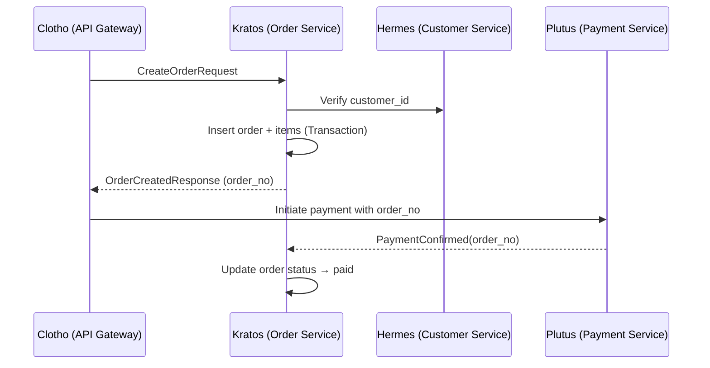

# AI Prompt — Kratos (Order Service)

You are generating a Go service named **Kratos**, the universal **Order Service Base** for the Fly platform.

---

## 🎯 Service Purpose

Kratos manages the entire **order lifecycle** — from creation to payment, fulfillment, and cancellation — and provides consistent, auditable transaction data for upstream and downstream domains.

It acts as the **transactional backbone** between:
- **Hermes (Customer Service)** — customer & tenant data
- **Plutus (Payment Service)** — payment records and wallet transactions
- **Clotho (API Gateway)** — request orchestration, JWT propagation, and trace correlation

---

## 🧩 Core Capabilities

1. **Order Management**
   - Create, update, cancel, and retrieve orders
   - Maintain idempotent order creation via unique business key (`order_no`)
   - Support tenant isolation via `tenant_id`
   - Store snapshot data for pricing, product info, and totals

2. **Order Items**
   - One-to-many structure for line-level details
   - Snapshot of product name, price, and quantity at creation time

3. **Order Status Transition**
   - State machine: `pending → paid → fulfilled | canceled`
   - Each transition recorded in `order_status_logs` with timestamp & reason

4. **Observability**
   - TraceID propagation using Mora’s `logger` + `observability`
   - Structured logs per request
   - Metrics exposed via Prometheus or OTel collector

5. **API Layer**
   - RESTful routes (gin)
   - gRPC service definition: `order.v1.OrderService`
   - JWT verification handled by Clotho middleware

6. **Database & Transactions**
   - MySQL schema via `sql-migrate`
   - Transaction-safe order creation & status updates
   - Referential integrity for `order_items` and `order_status_logs`

---

## 🧱 Project Structure

```
kratos/
├── cmd/kratosd/main.go               # Bootstrap HTTP + gRPC servers
├── configs/
│   ├── kratos.yaml                   # Config sample
│   └── migrations/                   # SQL migrations
├── internal/
│   ├── domain/                       # Entities, Repositories, Domain Services
│   ├── application/                  # UseCases
│   ├── infrastructure/               # DB, Cache, MQ, etc.
│   └── interface/                    # HTTP/gRPC Handlers
└── pkg/                              # Shared utils
```

---

## ⚙️ Stack Requirements

- **Language**: Go 1.22+
- **Frameworks**: gin, grpc-go
- **Database**: MySQL (via gorm/sqlx)
- **Cache**: Redis (go-redis)
- **Config & Logging**: from Mora
- **Tracing**: OpenTelemetry via Mora observability
- **Migration Tool**: sql-migrate

---

## 🧭 API Specification

### REST Endpoints

| Method | Path | Description |
|--------|------|--------------|
| `POST` | `/api/orders` | Create new order |
| `GET` | `/api/orders/{id}` | Retrieve order by ID |
| `GET` | `/api/orders` | List orders (filter by customer, status, date) |
| `PATCH` | `/api/orders/{id}/status` | Update order status |
| `GET` | `/api/orders/{id}/logs` | Retrieve status transition history |

### gRPC Services

```protobuf
service OrderService {
  rpc CreateOrder (CreateOrderRequest) returns (OrderResponse);
  rpc GetOrder (GetOrderRequest) returns (OrderResponse);
  rpc ListOrders (ListOrdersRequest) returns (ListOrdersResponse);
  rpc UpdateOrderStatus (UpdateOrderStatusRequest) returns (OrderResponse);
  rpc GetOrderLogs (GetOrderLogsRequest) returns (OrderLogsResponse);
}
```

---

## 🔄 Interactions



---

## 🚀 Future Enhancements

- Implement **refunds** and **partial cancellations**
- Integrate **outbox pattern** for event-driven consistency
- Add **webhooks** for status events (`paid`, `fulfilled`, `canceled`)
- Provide **tenant-level analytics** (order volume, AOV, conversion rate)
- Enable **multi-currency support** with real-time exchange rates

---

## 🧠 AI Development Guidelines

When generating code:
- Use `Mora` packages for config/logging/tracing
- Ensure all public APIs enforce tenant-level filtering
- Implement repository + service layer separation
- Add comments for domain invariants and transaction boundaries
- Output structured logs for `traceID`, `order_no`, and `user_id`
- Generate initial tests for domain logic & repository CRUD