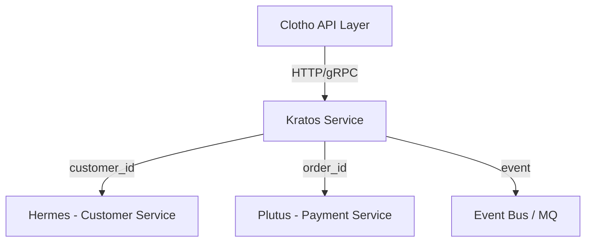

# Kratos - 订单服务

**Kratos** 是 Fly 平台的订单基座服务（Order Service Base）。  
象征秩序与执行，负责订单生命周期管理，是交易链路的中枢节点。

---

## 📌 模块职责与边界

- **负责**：
  - 订单主数据与状态机（pending → paid → fulfilled/canceled）
  - 订单明细（OrderItem）
  - 状态审计与变更日志
  - 与支付（Plutus）、客户（Hermes）的数据关联
- **不负责**：
  - 支付处理（由 Plutus 负责）
  - 客户信息（由 Hermes 负责）
- **边界**：
  - 专注订单本体逻辑：创建、状态流转、查询、审计。
  - 不承担库存、商品、支付职责，仅引用其ID或事件。

---

## 🚀 当前能力

- **订单生命周期管理**：创建、支付、履约、取消。
- **多明细支持**：一单多商品、多类型订单扩展。
- **审计记录**：每次状态变更均落入 `order_status_logs`。
- **API 支持**：REST + gRPC。
- **Mora 能力集成**：
  - config：配置加载
  - logger：结构化日志
  - db：MySQL 驱动封装
  - cache：Redis 缓存
  - observability：OpenTelemetry 链路追踪

---

## 🏗️ 系统架构

### 模块职责划分

- **Mora** → 能力库（认证令牌签名/验证、日志、配置、数据库、缓存、消息队列、工具函数）
- **Clotho** → API 编排层（入口点、信任/零信任、请求路由）
- **Kratos (订单域)** → 负责订单生命周期管理、状态机控制、订单审计
- **Hermes** → 客户服务（客户信息管理、联系方式管理）
- **Plutus** → 支付钱包服务（支付处理、钱包管理、交易记录）

---

## Kratos 核心职责

### 1. 订单生命周期管理

- 订单创建（订单号、客户ID、总金额、货币类型）
- 订单状态流转（pending → paid → fulfilled/canceled）
- 订单查询和更新
- 订单删除（软删除）
- 多租户订单隔离（基于 tenant_id）

### 2. 订单明细管理

- 订单商品明细（ProductID、商品名称、SKU、数量、单价）
- 明细总价自动计算（quantity * unit_price）
- 商品信息快照（防止商品信息变更影响历史订单）
- 明细与订单的关联管理

### 3. 状态机控制

- 严格的状态流转控制
- 状态变更验证（pending → paid → fulfilled/canceled）
- 状态变更日志记录
- 操作者信息追踪

### 4. 审计和日志

- 订单状态变更日志（order_status_logs）
- 订单操作审计（order_audit）
- 操作者身份追踪
- 操作内容快照（JSON 格式）

### 5. 多租户支持

- 基于租户ID的数据隔离
- 租户级别的查询和统计
- 租户上下文传递
- 跨租户数据保护

### 6. 双协议支持

- HTTP REST API（面向 Web 应用）
- gRPC 接口（面向微服务间通信）
- 统一的业务逻辑层
- 协议无关的数据模型

### 7. 可观测性和监控

- 分布式链路追踪（OpenTelemetry）
- 业务指标监控（Prometheus）
- 结构化日志输出
- 健康检查端点

---

## 🗄️ 数据库架构（DDL）

### orders 订单主表

```sql
CREATE TABLE orders (
  id BIGINT PRIMARY KEY AUTO_INCREMENT COMMENT '订单ID',
  tenant_id BIGINT NOT NULL COMMENT '租户ID（多租户隔离）',
  order_no VARCHAR(64) NOT NULL UNIQUE COMMENT '业务订单号（幂等创建标识）',
  customer_id BIGINT NOT NULL COMMENT '客户ID（来自Hermes）',
  total_amount DECIMAL(12,2) NOT NULL COMMENT '订单总金额',
  currency CHAR(3) NOT NULL DEFAULT 'CNY' COMMENT '货币类型',
  status ENUM('pending','paid','fulfilled','canceled') NOT NULL DEFAULT 'pending' COMMENT '订单状态机',
  remark VARCHAR(255) NULL COMMENT '订单备注',
  created_at DATETIME NOT NULL DEFAULT CURRENT_TIMESTAMP COMMENT '创建时间',
  updated_at DATETIME NOT NULL DEFAULT CURRENT_TIMESTAMP ON UPDATE CURRENT_TIMESTAMP COMMENT '更新时间',
  INDEX idx_tenant (tenant_id),
  INDEX idx_customer (customer_id),
  INDEX idx_status (status),
  INDEX idx_created_at (created_at)
) ENGINE=InnoDB DEFAULT CHARSET=utf8mb4 COMMENT='订单主表';
```

### order_items 订单明细表

```sql
CREATE TABLE order_items (
  id BIGINT PRIMARY KEY AUTO_INCREMENT COMMENT '订单明细ID',
  tenant_id BIGINT NOT NULL COMMENT '租户ID（多租户隔离）',
  order_id BIGINT NOT NULL COMMENT '关联订单ID',
  product_id BIGINT NULL COMMENT '商品ID（来自产品服务或外部系统）',
  product_name VARCHAR(256) NOT NULL COMMENT '商品名称（快照）',
  sku VARCHAR(128) NULL COMMENT 'SKU 编码（选填）',
  quantity INT NOT NULL DEFAULT 1 COMMENT '数量',
  unit_price DECIMAL(12,2) NOT NULL COMMENT '单价',
  total_price DECIMAL(12,2) GENERATED ALWAYS AS (quantity * unit_price) STORED COMMENT '行小计（自动计算）',
  created_at DATETIME NOT NULL DEFAULT CURRENT_TIMESTAMP COMMENT '创建时间',
  updated_at DATETIME NOT NULL DEFAULT CURRENT_TIMESTAMP ON UPDATE CURRENT_TIMESTAMP COMMENT '更新时间',
  INDEX idx_order (order_id),
  INDEX idx_tenant (tenant_id),
  CONSTRAINT fk_order_items_order FOREIGN KEY (order_id) REFERENCES orders(id) ON DELETE CASCADE
) ENGINE=InnoDB DEFAULT CHARSET=utf8mb4 COMMENT='订单明细表';
```

### order_status_logs 订单状态变更日志表

```sql
CREATE TABLE order_status_logs (
  id BIGINT PRIMARY KEY AUTO_INCREMENT COMMENT '日志ID',
  tenant_id BIGINT NOT NULL COMMENT '租户ID',
  order_id BIGINT NOT NULL COMMENT '订单ID',
  from_status ENUM('pending','paid','fulfilled','canceled') NULL COMMENT '变更前状态',
  to_status ENUM('pending','paid','fulfilled','canceled') NOT NULL COMMENT '变更后状态',
  reason VARCHAR(255) NULL COMMENT '状态变更原因',
  operator_id BIGINT NULL COMMENT '操作人ID（来自Custos）',
  created_at DATETIME NOT NULL DEFAULT CURRENT_TIMESTAMP COMMENT '操作时间',
  INDEX idx_order (order_id),
  INDEX idx_tenant (tenant_id),
  CONSTRAINT fk_order_logs_order FOREIGN KEY (order_id) REFERENCES orders(id) ON DELETE CASCADE
) ENGINE=InnoDB DEFAULT CHARSET=utf8mb4 COMMENT='订单状态变更日志表';
```

### order_audit 订单审计记录表

```sql
CREATE TABLE order_audit (
  id BIGINT PRIMARY KEY AUTO_INCREMENT COMMENT '审计ID',
  tenant_id BIGINT NOT NULL COMMENT '租户ID',
  order_id BIGINT NOT NULL COMMENT '订单ID',
  action VARCHAR(64) NOT NULL COMMENT '操作类型（CREATE/UPDATE/DELETE）',
  actor VARCHAR(128) NULL COMMENT '操作者',
  payload JSON NULL COMMENT '操作内容（JSON 格式快照）',
  created_at DATETIME NOT NULL DEFAULT CURRENT_TIMESTAMP COMMENT '操作时间',
  INDEX idx_order (order_id),
  INDEX idx_tenant (tenant_id)
) ENGINE=InnoDB DEFAULT CHARSET=utf8mb4 COMMENT='订单审计记录表';
```

---

## 项目结构

```text
kratos/
├── cmd/
│   └── kratos/                 # 主应用程序入口点
├── configs/
│   ├── kratos.yaml             # 服务配置文件
│   └── migrations/             # 数据库迁移文件
│       └── 001_initial_schema.sql
├── docs/
│   ├── docs.go                 # Swagger 文档生成
│   ├── swagger.json            # OpenAPI 3.0 规范
│   └── swagger.yaml            # Swagger YAML 格式
├── internal/
│   ├── application/            # 应用层（用例）
│   │   └── service/           # 应用服务实现
│   │       ├── order_service.go
│   │       └── order_service_test.go
│   ├── domain/                # 域层（业务逻辑）
│   │   ├── entity/            # 域实体
│   │   │   └── order.go       # 订单、订单明细、状态日志、审计实体
│   │   └── repository/        # 仓储接口
│   │       └── interfaces.go  # 数据访问接口定义
│   ├── infrastructure/        # 基础设施层
│   │   ├── cache/             # 缓存实现
│   │   │   └── order_cache.go
│   │   ├── database/          # 数据持久化
│   │   │   ├── order_repository.go
│   │   │   └── repositories.go
│   │   └── mora/              # Mora 框架集成
│   │       ├── config.go
│   │       ├── logger.go
│   │       └── observability.go
│   └── interface/             # 接口层（HTTP/gRPC 处理器）
│       ├── grpc/              # gRPC 接口实现
│       │   ├── order_handler.go
│       │   └── middleware.go
│       └── http/              # HTTP 接口实现
│           ├── order_handler.go
│           ├── order_handler_test.go
│           └── router.go
├── pkg/                       # Kratos 特定包
│   ├── constants/             # 域特定常量
│   │   └── constants.go       # 服务常量定义
│   ├── errors/                # 域特定错误
│   │   └── errors.go          # 错误类型定义
│   └── types/                 # 域特定类型
│       └── types.go           # 请求/响应类型定义
├── api/
│   └── proto/                 # Protocol Buffers 定义
│       └── order/
│           └── v1/
│               ├── order.proto       # gRPC 服务定义
│               ├── order.pb.go       # 生成的 Go 代码
│               └── order_grpc.pb.go  # 生成的 gRPC 代码
├── go.mod
├── go.sum
├── Makefile
└── README.md
```

---

## 层职责说明

### 域层 (`internal/domain/`)

**实体** (`entity/`):
- `Order`: 核心订单实体，包含状态机逻辑和业务规则
- `OrderItem`: 订单明细实体，支持商品信息快照
- `OrderStatusLog`: 状态变更日志实体
- `OrderAudit`: 订单审计实体

**仓储** (`repository/`):
- `OrderRepository`: 订单数据访问契约
- `OrderItemRepository`: 订单明细数据访问契约
- `OrderStatusLogRepository`: 状态日志数据访问契约
- `OrderAuditRepository`: 审计数据访问契约

### 应用层 (`internal/application/`)

**服务** (`service/`):
- `OrderService`: 订单管理业务逻辑
- 包含订单 CRUD 操作和状态机管理
- 支持订单明细关联查询
- 状态变更验证和审计日志

### 基础设施层 (`internal/infrastructure/`)

**持久化** (`database/`):
- `order_repository.go`: MySQL 订单数据访问实现
- 使用 GORM 进行数据库操作
- 支持多租户查询和分页

**缓存** (`cache/`):
- `order_cache.go`: Redis 缓存实现
- 订单查询结果缓存
- 性能优化

**Mora 集成** (`mora/`):
- `config.go`: 配置管理
- `logger.go`: 日志记录
- `observability.go`: 可观测性集成

### 接口层 (`internal/interface/`)

**HTTP** (`http/`):
- `order_handler.go`: HTTP 请求处理器
- 支持 RESTful API 设计
- 集成 Swagger 文档生成
- 统一的错误处理

**gRPC** (`grpc/`):
- `order_handler.go`: gRPC 服务处理器
- 支持微服务间通信
- Protocol Buffers 序列化
- 错误码转换

---

## 🌐 接入方式

### HTTP API

| 路径 | 方法 | 描述 |
|------|------|------|
| `/api/orders` | POST | 创建订单 |
| `/api/orders/{id}` | GET | 查询订单详情 |
| `/api/orders/{id}/items` | GET | 查询订单详情（含明细） |
| `/api/orders` | GET | 分页查询订单列表 |
| `/api/orders/{id}/status` | PATCH | 更新订单状态 |
| `/api/orders/{id}` | DELETE | 删除订单 |
| `/health` | GET | 健康检查 |
| `/swagger/*any` | GET | API 文档 |

### gRPC API

`OrderService`  
- `CreateOrder` - 创建订单
- `GetOrder` - 获取订单
- `GetOrderWithItems` - 获取订单及明细
- `ListOrders` - 订单列表查询
- `UpdateOrderStatus` - 更新订单状态
- `DeleteOrder` - 删除订单

### 鉴权

- 通过 Clotho 网关注入的 JWT（由 Custos 验签）
- 在中间件中统一解析 user 与 tenant 上下文

---

## 🔄 模块交互关系



---

## 核心特性

### 订单管理
- 订单 CRUD 操作
- 多租户数据隔离
- 订单号唯一性验证
- 订单状态管理

### 订单明细管理
- 多商品明细支持
- 商品信息快照
- 明细总价自动计算
- 明细与订单关联

### 状态机控制
- 严格的状态流转控制
- 状态变更验证
- 状态变更日志
- 操作者追踪

### 审计和日志
- 订单操作审计
- 状态变更日志
- 操作内容快照
- 操作者身份追踪

### 分页查询
- 支持大数据量分页
- 按客户、状态筛选
- 数据库索引优化
- 查询性能监控

### 双协议支持
- HTTP REST API
- gRPC 接口
- 统一业务逻辑
- 协议无关设计

---

## 未来增强

### 分布式事务
- DTM 集成支持
- SAGA 模式（长流程）
- TCC 模式（高一致性）
- XA 模式（数据库事务）

### 事件驱动架构
- 订单生命周期事件
- 审计日志
- 消息队列集成

### 高级查询
- 全文搜索支持
- 复杂查询条件
- 数据导出功能

### 监控和可观测性
- 业务指标监控
- 性能分析
- 告警机制

---

## 依赖关系

### 外部依赖
- **Gin**: HTTP Web 框架
- **GORM**: ORM 数据库操作
- **Protocol Buffers**: gRPC 序列化
- **OpenTelemetry**: 链路追踪

### 内部依赖（Mora 生态）
- **Mora**: 共享能力库
- **Clotho**: API 编排（未来）
- **Hermes**: 客户服务
- **Plutus**: 支付钱包服务

---

## ⚙️ 配置样例

`configs/kratos.yaml`

```yaml
server:
  http_port: 8082
  grpc_port: 9092
database:
  driver: mysql
  dsn: user:password@tcp(mysql:3306)/kratos?charset=utf8mb4&parseTime=True&loc=Local
redis:
  addr: redis:6379
  db: 0
observability:
  service_name: kratos
  endpoint: http://otel-collector:4317
```

---

## 配置管理

环境变量通过 `configs/kratos.yaml` 管理：
- 数据库连接设置
- 服务端口配置
- 缓存配置
- 可观测性配置

---

## 测试策略

- 域逻辑单元测试
- 用例集成测试
- HTTP 处理器测试
- gRPC 服务测试
- 数据库迁移测试

---

## 开发工作流

1. **域优先**: 从域实体和业务规则开始
2. **仓储模式**: 定义数据访问接口
3. **用例实现**: 实现应用逻辑
4. **基础设施**: 添加持久化和外部服务实现
5. **接口层**: 创建 HTTP/gRPC 处理器和中间件
6. **测试**: 添加全面的测试覆盖

---

## 🧠 开发约定

- 所有请求遵循统一响应模型 `{code, message, data}`
- 错误码集中定义于 `pkg/errors`
- 所有数据库操作通过 Repository 层封装
- 所有外部接口调用必须携带 TraceID
- 严禁在 Handler 层直接操作 DB 或 Redis

---

## 🧪 测试与部署

### 本地运行
```bash
make run
```

### 单元测试
```bash
make test
```

### 构建应用
```bash
make build
```

### 生成 API 文档
```bash
make swagger
```

### 容器化
```bash
docker build -t fly-kratos .
docker run -p 8082:8082 -p 9092:9092 fly-kratos
```

### 依赖服务
- MySQL（数据库）
- Redis（缓存，配置中可选）
- OpenTelemetry（可观测性，配置中可选）

---

## ✅ 当前实现状态

Kratos 服务已**完全实现**，包含以下功能：

### 🏗️ 完整的项目结构
- **领域层**：订单实体、状态枚举、仓储接口定义
- **应用层**：订单服务业务逻辑，包含完整的状态机管理
- **基础设施层**：GORM 数据库仓储实现
- **接口层**：HTTP REST API 处理器
- **通用组件**：错误处理、类型定义、常量定义

### 📋 API 端点（已实现）
| 路径 | 方法 | 描述 | 状态 |
|------|------|------|------|
| `/api/orders` | POST | 创建订单 | ✅ 已实现 |
| `/api/orders/{id}` | GET | 查询订单详情 | ✅ 已实现 |
| `/api/orders/{id}/items` | GET | 查询订单详情（含明细） | ✅ 已实现 |
| `/api/orders` | GET | 分页查询订单列表 | ✅ 已实现 |
| `/api/orders/{id}/status` | PATCH | 更新订单状态 | ✅ 已实现 |
| `/api/orders/{id}` | DELETE | 删除订单 | ✅ 已实现 |
| `/health` | GET | 健康检查 | ✅ 已实现 |
| `/swagger/*any` | GET | API 文档 | ✅ 已实现 |

### 🧪 测试覆盖
- **服务层测试**：包含创建、查询、更新、删除、列表等完整测试用例
- **HTTP 接口测试**：包含所有 API 端点的测试用例
- **Mock 实现**：完整的仓储层 Mock 用于单元测试
- **错误处理测试**：重复订单号、无效状态转换等异常场景

### 🔧 技术特性
- **状态机管理**：严格的订单状态流转控制
- **审计日志**：完整的状态变更和操作审计
- **多租户支持**：基于租户 ID 的数据隔离
- **分页查询**：支持按客户、状态等条件筛选
- **参数验证**：完整的请求参数校验
- **错误处理**：统一的错误码和错误信息
- **Swagger 文档**：自动生成的 API 文档

### 🚀 部署就绪
- 所有测试通过 ✅
- 代码编译成功 ✅
- Swagger 文档生成 ✅
- Makefile 命令完整 ✅
- 配置文件模板完整 ✅

---

## 🔭 未来迭代方向

- 支持退款与部分退款（与 Plutus 对齐）
- 履约节点扩展（发货/签收/服务完成）
- 幂等键（Idempotency-Key）与事件驱动架构
- 引入 Saga / Outbox 模式支持分布式事务
- 统一的事件追踪与重放机制

---

## AI 助手指南

- 使用清晰、描述性的函数和变量名
- 为复杂的业务逻辑添加全面的注释
- 遵循 Go 约定和最佳实践
- 保持一致的错误处理模式
- 记录架构决策和权衡

---

## 🤝 贡献

1. Fork 项目
2. 创建特性分支 (`git checkout -b feature/AmazingFeature`)
3. 提交更改 (`git commit -m 'Add some AmazingFeature'`)
4. 推送到分支 (`git push origin feature/AmazingFeature`)
5. 开启 Pull Request

---

## 📄 许可证

本项目采用 Apache 2.0 许可证 - 查看 [LICENSE](LICENSE) 文件了解详情。

---

## 🔗 相关服务

- [Hermes - 客户服务](../hermes/README.md)
- [Plutus - 支付钱包服务](../plutus/README.md)
- [Mora - 基础框架](../mora/README.md)
- [Custos - 认证授权服务](../custos/README.md)

---

## 最后更新

2025-01-27
