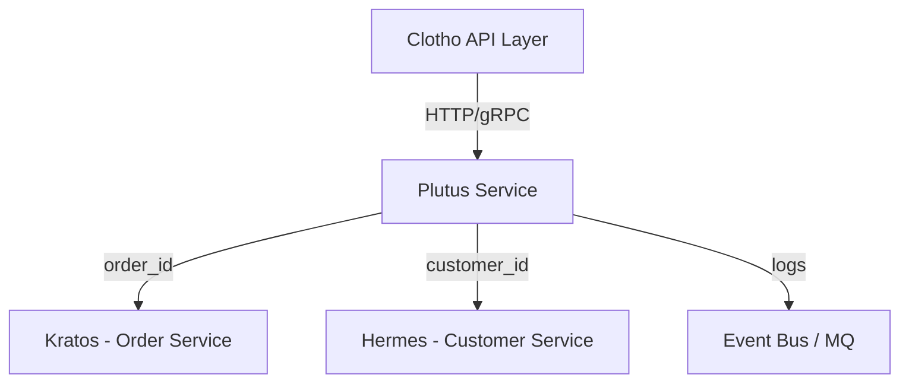

# Plutus (Payment & Wallet Service)

**Plutus** 是 Fly 平台的支付与钱包基座服务。  
在希腊神话中，Plutus 是财富之神，象征财富的分配与流转。该模块负责所有支付、钱包、交易流水的核心逻辑。

---

## 📌 模块职责与边界

- **负责**：
  - 钱包账户管理（Wallet）
  - 交易记录（Transaction）
  - 充值、消费、退款逻辑
  - 外部支付渠道记录（ChannelLog）
- **不负责**：
  - 订单生命周期管理（由 Kratos 负责）
  - 客户信息管理（由 Hermes 负责）
  - CRM 或会员系统逻辑
- **边界**：
  - 提供统一的账户体系（Wallet）与资金流记录。
  - 独立实现事务一致性，所有余额修改均具备原子性。

---

## 🚀 当前能力

- 多租户账户模型：`tenant_id + customer_id` 唯一钱包。
- 支持交易类型：充值（recharge）、消费（consume）、退款（refund）。
- 支持幂等交易（idempotent key）。
- 余额安全更新（事务 + FOR UPDATE）。
- 完整的交易流水审计。
- 提供 REST + gRPC 双协议访问。
- Mora 能力集成：
  - `config`：配置加载。
  - `logger`：结构化日志。
  - `db`：数据库封装。
  - `cache`：Redis 分布式锁。
  - `observability`：OpenTelemetry 链路追踪。

---

## 🗄️ 数据库设计（MySQL）

详见 `configs/migrations/001_init_plutus.sql`

| 表名 | 说明 |
|------|------|
| `wallets` | 用户钱包账户表 |
| `transactions` | 交易流水表 |
| `payment_channels` | 支付渠道记录表（可选） |

所有变动均通过事务执行，并记录在 `transactions` 中。

---

## 🌐 接口定义

### REST API
| Method | Path | 描述 |
|--------|------|------|
| `POST` | `/api/wallets` | 创建钱包 |
| `GET` | `/api/wallets/{id}` | 查询钱包余额 |
| `POST` | `/api/transactions/recharge` | 钱包充值 |
| `POST` | `/api/transactions/consume` | 钱包消费 |
| `POST` | `/api/transactions/refund` | 退款 |
| `GET` | `/api/transactions` | 交易流水查询 |

### gRPC
```protobuf
service WalletService {
  rpc GetWallet(GetWalletRequest) returns (WalletResponse);
  rpc CreateWallet(CreateWalletRequest) returns (WalletResponse);
  rpc Recharge(RechargeRequest) returns (TransactionResponse);
  rpc Consume(ConsumeRequest) returns (TransactionResponse);
  rpc Refund(RefundRequest) returns (TransactionResponse);
  rpc ListTransactions(ListTransactionsRequest) returns (ListTransactionsResponse);
}
```

---

## 🔄 模块交互关系



---

## ⚙️ 配置样例

`configs/plutus.yaml`

```yaml
server:
  http_port: 8083
  grpc_port: 9093
database:
  driver: mysql
  dsn: user:password@tcp(mysql:3306)/plutus?charset=utf8mb4&parseTime=True&loc=Local
redis:
  addr: redis:6379
  db: 0
observability:
  service_name: plutus
  endpoint: http://otel-collector:4317
```

---

## 🔭 未来迭代方向

- 接入第三方支付网关（WeChat、Alipay、Stripe）
- 对账与结算系统
- 分账与多方结算
- 支持预授权与冻结金额
- 异步回调与重试机制
- Webhook 通知机制

---

## 🧠 开发约定

- 所有资金操作必须在事务中完成。
- 每个变动必须写入 `transactions` 表。
- 严禁直接修改 `wallets.balance`。
- 所有外部回调需验证签名。
- 所有接口必须记录 traceID 与 user_id。
- 失败操作必须具备幂等性。