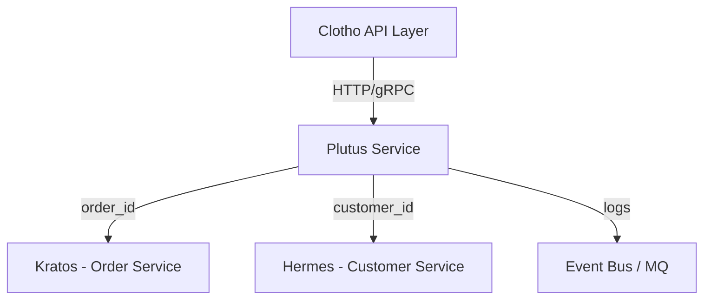

# Plutus (Payment & Wallet Service)

**Plutus** 是 Fly 平台的支付与钱包基座服务。  
在希腊神话中，Plutus 是财富之神，象征财富的分配与流转。该模块负责所有支付、钱包、交易流水的核心逻辑。

---

## 📌 模块职责与边界

- **负责**：
  - 钱包账户管理（Wallet）
  - 交易记录（Transaction）
  - 充值、消费、退款逻辑
  - 外部支付渠道记录（ChannelLog）
- **不负责**：
  - 订单生命周期管理（由 Kratos 负责）
  - 客户信息管理（由 Hermes 负责）
  - CRM 或会员系统逻辑
- **边界**：
  - 提供统一的账户体系（Wallet）与资金流记录。
  - 独立实现事务一致性，所有余额修改均具备原子性。

---

## 🚀 当前能力

- 多租户账户模型：`tenant_id + customer_id` 唯一钱包。
- 支持交易类型：充值（recharge）、消费（consume）、退款（refund）。
- 支持幂等交易（idempotent key）。
- 余额安全更新（事务 + FOR UPDATE）。
- 完整的交易流水审计。
- 提供 REST + gRPC 双协议访问。
- Mora 能力集成：
  - `config`：配置加载。
  - `logger`：结构化日志。
  - `db`：数据库封装。
  - `cache`：Redis 分布式锁。
  - `observability`：OpenTelemetry 链路追踪。

---

## 🗄️ 数据库设计（MySQL）

详见 `configs/migrations/001_initial_schema.sql`

### wallets (钱包账户表)

```sql
CREATE TABLE IF NOT EXISTS wallets (
  id BIGINT PRIMARY KEY AUTO_INCREMENT COMMENT '钱包ID',
  tenant_id BIGINT NOT NULL COMMENT '租户ID（多租户隔离）',
  customer_id BIGINT NOT NULL COMMENT '客户ID（Hermes.customers.id）',
  balance DECIMAL(14,2) NOT NULL DEFAULT 0 COMMENT '当前余额',
  currency CHAR(3) NOT NULL DEFAULT 'CNY' COMMENT '货币：ISO 4217',
  status ENUM('active','frozen') NOT NULL DEFAULT 'active' COMMENT '钱包状态',
  created_at DATETIME NOT NULL DEFAULT CURRENT_TIMESTAMP COMMENT '创建时间',
  updated_at DATETIME NOT NULL DEFAULT CURRENT_TIMESTAMP ON UPDATE CURRENT_TIMESTAMP COMMENT '更新时间',
  UNIQUE KEY uk_tenant_customer (tenant_id, customer_id),
  KEY idx_tenant (tenant_id),
  KEY idx_customer (customer_id)
) ENGINE=InnoDB DEFAULT CHARSET=utf8mb4 COMMENT='用户钱包账户';
```

- **唯一约束**：每个 `(tenant_id, customer_id)` 唯一对应一个钱包
- **余额字段**：使用 DECIMAL(14,2) 保证精度
- **状态管理**：`active` (活跃) / `frozen` (冻结)

### transactions (交易流水表)

```sql
CREATE TABLE IF NOT EXISTS transactions (
  id BIGINT PRIMARY KEY AUTO_INCREMENT COMMENT '交易ID',
  tenant_id BIGINT NOT NULL COMMENT '租户ID',
  wallet_id BIGINT NOT NULL COMMENT '关联钱包ID（FK wallets.id）',
  order_id BIGINT NULL COMMENT 'Kratos.orders.id；纯充值可为空',
  type ENUM('recharge','consume','refund') NOT NULL COMMENT '交易类型',
  amount DECIMAL(14,2) NOT NULL COMMENT '交易金额（正数）',
  currency CHAR(3) NOT NULL DEFAULT 'CNY' COMMENT '币种',
  channel ENUM('wallet','wechat','alipay','stripe','paypal','bank','other') NOT NULL DEFAULT 'wallet' COMMENT '支付渠道',
  status ENUM('pending','success','failed') NOT NULL DEFAULT 'pending' COMMENT '交易状态',
  idempotency_key VARCHAR(128) NULL COMMENT '幂等键（外部请求唯一标识）',
  reference_no VARCHAR(128) NULL COMMENT '外部渠道流水号/参考号',
  meta JSON NULL COMMENT '扩展信息：回执/错误码/签名校验等',
  created_at DATETIME NOT NULL DEFAULT CURRENT_TIMESTAMP COMMENT '创建时间',
  updated_at DATETIME NOT NULL DEFAULT CURRENT_TIMESTAMP ON UPDATE CURRENT_TIMESTAMP COMMENT '更新时间',
  KEY idx_wallet (wallet_id),
  KEY idx_tenant (tenant_id),
  KEY idx_order (order_id),
  KEY idx_status (status),
  UNIQUE KEY uk_tenant_idemp (tenant_id, idempotency_key),
  CONSTRAINT fk_tx_wallet FOREIGN KEY (wallet_id) REFERENCES wallets(id) ON DELETE CASCADE
) ENGINE=InnoDB DEFAULT CHARSET=utf8mb4 COMMENT='资金交易流水（不可变更）';
```

- **不可变性**：交易一旦创建不可修改（审计要求）
- **幂等性**：`idempotency_key` 防止重复提交
- **多类型**：支持充值 (recharge)、消费 (consume)、退款 (refund)
- **多渠道**：钱包内部、微信、支付宝、Stripe 等

### payment_channels (支付渠道配置表)

```sql
CREATE TABLE IF NOT EXISTS payment_channels (
  id BIGINT PRIMARY KEY AUTO_INCREMENT COMMENT '渠道配置ID',
  tenant_id BIGINT NOT NULL COMMENT '租户ID',
  name VARCHAR(64) NOT NULL COMMENT '渠道名（展示）',
  type ENUM('wechat','alipay','stripe','paypal','bank','other') NOT NULL COMMENT '渠道类型',
  config JSON NULL COMMENT '配置JSON：app_id、mch_id、api_key、证书路径、回调URL等',
  status ENUM('active','inactive') NOT NULL DEFAULT 'active' COMMENT '状态',
  created_at DATETIME NOT NULL DEFAULT CURRENT_TIMESTAMP COMMENT '创建时间',
  updated_at DATETIME NOT NULL DEFAULT CURRENT_TIMESTAMP ON UPDATE CURRENT_TIMESTAMP COMMENT '更新时间',
  UNIQUE KEY uk_tenant_name (tenant_id, name),
  KEY idx_tenant (tenant_id)
) ENGINE=InnoDB DEFAULT CHARSET=utf8mb4 COMMENT='第三方支付渠道配置';
```

- **租户隔离**：每个租户可配置独立的支付渠道
- **配置灵活**：使用 JSON 字段存储各渠道专有配置
- **安全提示**：生产环境建议加密敏感字段或使用密钥管理系统

### channel_callbacks (第三方回调留痕表)

```sql
CREATE TABLE IF NOT EXISTS channel_callbacks (
  id BIGINT PRIMARY KEY AUTO_INCREMENT COMMENT '回调记录ID',
  tenant_id BIGINT NOT NULL COMMENT '租户ID',
  channel_id BIGINT NULL COMMENT 'payment_channels.id（可空）',
  reference_no VARCHAR(128) NULL COMMENT '外部单号/回执号',
  request_body MEDIUMTEXT NULL COMMENT '回调请求原文',
  response_body MEDIUMTEXT NULL COMMENT '回调应答原文',
  http_status INT NULL COMMENT 'HTTP 状态码',
  verified TINYINT(1) NOT NULL DEFAULT 0 COMMENT '签名是否通过校验',
  created_at DATETIME NOT NULL DEFAULT CURRENT_TIMESTAMP COMMENT '回调时间',
  KEY idx_tenant (tenant_id),
  KEY idx_channel (channel_id),
  KEY idx_reference (reference_no)
) ENGINE=InnoDB DEFAULT CHARSET=utf8mb4 COMMENT='第三方回调留痕';
```

- **审计追踪**：保存第三方支付回调的完整请求/响应
- **调试友好**：便于排查支付问题和对账差异
- **存储优化**：大字段建议配置冷热分层或短期存储策略

---

## 🌐 接口定义

### REST API
| Method | Path | 描述 |
|--------|------|------|
| `POST` | `/api/wallets` | 创建钱包 |
| `GET` | `/api/wallets/{id}` | 查询钱包余额 |
| `POST` | `/api/transactions/recharge` | 钱包充值 |
| `POST` | `/api/transactions/consume` | 钱包消费 |
| `POST` | `/api/transactions/refund` | 退款 |
| `GET` | `/api/transactions` | 交易流水查询 |

### gRPC
```protobuf
service WalletService {
  rpc GetWallet(GetWalletRequest) returns (WalletResponse);
  rpc CreateWallet(CreateWalletRequest) returns (WalletResponse);
  rpc Recharge(RechargeRequest) returns (TransactionResponse);
  rpc Consume(ConsumeRequest) returns (TransactionResponse);
  rpc Refund(RefundRequest) returns (TransactionResponse);
  rpc ListTransactions(ListTransactionsRequest) returns (ListTransactionsResponse);
}
```

---

## 🔄 模块交互关系



---

## ⚙️ 配置说明

### 完整配置文件示例

`configs/plutus.yaml`

```yaml
# 服务器配置
server:
  name: "plutus"
  version: "1.0.0"
  http_port: 8085                # HTTP 服务端口
  grpc_port: 9085                # gRPC 服务端口
  shutdown_timeout: 30s          # 优雅关闭超时

# 数据库配置
database:
  driver: "mysql"
  dsn: "root:password@tcp(localhost:3306)/plutus?charset=utf8mb4&parseTime=True&loc=Local"
  max_open_conns: 100            # 最大打开连接数
  max_idle_conns: 10             # 最大空闲连接数
  conn_max_lifetime: 3600s       # 连接最大生命周期
  log_level: "info"              # 数据库日志级别

# 缓存配置 (Redis)
cache:
  driver: "redis"
  address: "localhost:6379"
  password: ""
  db: 0
  pool_size: 10
  min_idle_conns: 5
  dial_timeout: 5s
  read_timeout: 3s
  write_timeout: 3s

# 日志配置
logger:
  level: "info"                  # 日志级别: debug, info, warn, error
  format: "json"                 # 日志格式: json, text
  output: "stdout"               # 输出目标: stdout, file
  file_config:
    filename: "logs/plutus.log"
    max_size: 100                # 单文件最大 MB
    max_backups: 10              # 保留备份数
    max_age: 30                  # 保留天数

# 可观测性配置
observability:
  tracing:
    enabled: true
    endpoint: "http://localhost:4317"
    service_name: "plutus"
    service_version: "1.0.0"
    sample_ratio: 0.1            # 采样率 (0.0-1.0)

  metrics:
    enabled: true
    port: 9090
    path: "/metrics"

  health:
    enabled: true
    port: 8081
    path: "/health"

# DTM 分布式事务配置
dtm:
  server: "localhost:36790"
  timeout: 30s
  retry_interval: 1s
  request_timeout: 3s

# 限流配置
rate_limit:
  enabled: true
  requests_per_second: 1000
  burst: 2000

# 认证配置
auth:
  jwt_secret: "your-jwt-secret-key"
  token_expire: 3600s
  custos_endpoint: "localhost:8081"
```

---

## 🔭 未来迭代方向

- 接入第三方支付网关（WeChat、Alipay、Stripe）
- 对账与结算系统
- 分账与多方结算
- 支持预授权与冻结金额
- 异步回调与重试机制
- Webhook 通知机制

---

## 🚀 快速开始

### 前置要求

- Go 1.25+
- MySQL 8.0+
- Redis 6.0+
- Docker (可选，用于容器化部署)

### 本地开发

```bash
# 克隆项目
cd fly/plutus

# 安装依赖
make deps

# 生成 Swagger 文档
make swagger

# 运行服务
make run

# 或使用 Docker
make docker-build
make docker-run
```

### 验证服务

```bash
# 健康检查
curl http://localhost:8085/health

# 查看 API 文档
open http://localhost:8085/swagger/index.html

# 查看指标
curl http://localhost:9090/metrics
```

---

## 🧪 测试

```bash
# 运行所有测试
make test

# 运行测试并生成覆盖率报告
make test-coverage

# 查看覆盖率报告
open coverage.html

# 代码格式化
make fmt

# 代码检查
make lint

# 运行所有检查（格式化 + Lint + 测试）
make check
```

---

## 🔌 API 使用示例

### 创建钱包

```bash
curl -X POST http://localhost:8085/api/wallets \
  -H "Content-Type: application/json" \
  -H "Authorization: Bearer $TOKEN" \
  -d '{
    "customer_id": 1,
    "tenant_id": 1,
    "currency": "CNY"
  }'
```

### 钱包充值

```bash
curl -X POST http://localhost:8085/api/transactions/recharge \
  -H "Content-Type: application/json" \
  -H "Authorization: Bearer $TOKEN" \
  -d '{
    "customer_id": 1,
    "amount": 100.00,
    "channel": "wechat",
    "idempotency_key": "recharge_20250115_001"
  }'
```

### 钱包消费

```bash
curl -X POST http://localhost:8085/api/transactions/consume \
  -H "Content-Type: application/json" \
  -H "Authorization: Bearer $TOKEN" \
  -d '{
    "wallet_id": 1,
    "amount": 50.00,
    "order_id": 1001,
    "idempotency_key": "consume_20250115_001"
  }'
```

### 查询钱包余额

```bash
curl -X GET http://localhost:8085/api/wallets/1 \
  -H "Authorization: Bearer $TOKEN"
```

### 查询交易流水

```bash
curl -X GET "http://localhost:8085/api/transactions?wallet_id=1&page=1&page_size=20" \
  -H "Authorization: Bearer $TOKEN"
```

---

## 📊 实现状态

### ✅ 已完成 (90%)

#### 核心功能
- ✅ 钱包创建和管理
- ✅ 交易流水记录（充值、消费、退款）
- ✅ 幂等性支持 (idempotency_key)
- ✅ 余额原子更新（事务 + FOR UPDATE）
- ✅ 多租户数据隔离

#### API 接口
- ✅ REST API 完整实现
- ✅ gRPC API 接口定义
- ✅ Swagger API 文档生成
- ✅ JWT 认证集成

#### 数据层
- ✅ MySQL 数据库集成
- ✅ Redis 缓存集成
- ✅ 数据库迁移脚本
- ✅ 完整的数据库 Schema

#### 可观测性
- ✅ OpenTelemetry 链路追踪
- ✅ Prometheus 指标收集
- ✅ 结构化日志输出
- ✅ 健康检查端点

#### 部署
- ✅ Dockerfile
- ✅ Makefile 构建工具
- ✅ 配置文件管理

### 🔧 待完善 (10%)

- ⏳ 第三方支付渠道集成（微信、支付宝、Stripe）
- ⏳ 支付回调处理和签名验证
- ⏳ 对账功能
- ⏳ 分布式事务集成测试
- ⏳ 性能压测报告
- ⏳ 更多单元测试覆盖

---

## 📋 Makefile 命令

| 命令 | 说明 |
|------|------|
| `make build` | 构建应用程序 |
| `make run` | 运行应用程序 |
| `make test` | 运行所有测试 |
| `make test-coverage` | 运行测试并生成覆盖率报告 |
| `make clean` | 清理构建产物 |
| `make swagger` | 生成 Swagger 文档 |
| `make deps` | 下载依赖 |
| `make install-tools` | 安装开发工具 |
| `make fmt` | 格式化代码 |
| `make lint` | 运行 Lint 检查 |
| `make check` | 运行所有检查（fmt + lint + test） |
| `make docker-build` | 构建 Docker 镜像 |
| `make docker-run` | 运行 Docker 容器 |
| `make dev-setup` | 开发环境初始化 |

---

## 🧠 开发约定

- 所有资金操作必须在事务中完成。
- 每个变动必须写入 `transactions` 表。
- 严禁直接修改 `wallets.balance`。
- 所有外部回调需验证签名。
- 所有接口必须记录 traceID 与 user_id。
- 失败操作必须具备幂等性。