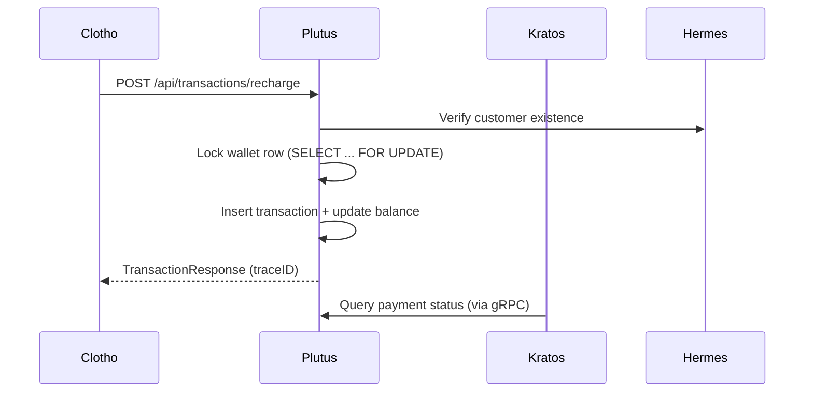

# AI Prompt — Plutus (Payment & Wallet Service)

You are generating a Go service named **Plutus**, the Payment & Wallet Base for the Fly platform.

---

## 🧭 Purpose

Plutus provides unified wallet management, transaction recording, and payment gateway abstraction.  
It ensures strong data consistency and auditability across the Fly platform, serving as the financial backbone that supports Kratos (orders) and Hermes (customers).

---

## ⚙️ Capabilities

1. **Wallet Management**
   - One wallet per `(tenant_id, customer_id)`
   - Auto-created on-demand
   - Tracks balance in atomic transactions

2. **Transaction Logging**
   - Immutable transaction records
   - Transaction types: recharge, consume, refund
   - Idempotency key for each transaction
   - Linked to orders via `order_id` (if provided)

3. **External Payment Channel**
   - Optional table for gateway callbacks and receipts
   - Support WeChat/Alipay/Stripe adapters

4. **Observability**
   - Structured logging (via Mora)
   - OpenTelemetry tracing
   - Metrics exposed to Prometheus

5. **APIs**
   - REST endpoints under `/api/wallets` and `/api/transactions`
   - gRPC: `WalletService`, `TransactionService`
   - JWT auth from Custos validated through Clotho

---

## 🧱 Project Layout

```
plutus/
├── cmd/plutusd/main.go
├── configs/
│   ├── plutus.yaml
│   └── migrations/001_init_plutus.sql
├── internal/
│   ├── domain/        # Entities, repositories, services
│   ├── application/   # Use cases
│   ├── infrastructure # Persistence, cache, external gateways
│   └── interface/     # HTTP/gRPC handlers
└── pkg/               # Shared utilities
```

---

## 📡 REST API Design

| Method | Path | Description |
|--------|------|-------------|
| POST | `/api/wallets` | Create wallet |
| GET | `/api/wallets/{id}` | Get wallet balance |
| POST | `/api/transactions/recharge` | Recharge wallet |
| POST | `/api/transactions/consume` | Spend from wallet |
| POST | `/api/transactions/refund` | Refund transaction |
| GET | `/api/transactions` | List transactions |

---

## 🧬 gRPC Interface

```protobuf
service WalletService {
  rpc GetWallet(GetWalletRequest) returns (WalletResponse);
  rpc CreateWallet(CreateWalletRequest) returns (WalletResponse);
  rpc Recharge(RechargeRequest) returns (TransactionResponse);
  rpc Consume(ConsumeRequest) returns (TransactionResponse);
  rpc Refund(RefundRequest) returns (TransactionResponse);
  rpc ListTransactions(ListTransactionsRequest) returns (ListTransactionsResponse);
}
```

---

## 🧩 Database Schema

**Wallets**
- `tenant_id`, `customer_id`
- `balance` (DECIMAL)
- `currency` (default: CNY)
- `created_at`, `updated_at`

**Transactions**
- `wallet_id`
- `type` ENUM(`recharge`,`consume`,`refund`)
- `amount`, `status`, `idempotent_key`
- `order_id`, `channel`, `reference_no`
- Audit timestamps

**Payment Channels**
- Channel type, payload, callback logs

---

## 🔄 Interaction Diagram



---

## 🚀 Future Extensions

- Multi-currency support
- Ledger-based double-entry accounting
- Integration with 3rd-party payment gateways
- Refund and settlement workflows
- Balance snapshots and audit trails
- Real-time event streaming for financial analytics

---

## 🧠 AI Development Rules

When generating code:
- Use Mora for all base capabilities (config/logger/db/cache/observability)
- All balance mutations must occur inside DB transactions
- Write unit tests for transaction isolation & idempotency
- Enforce tenant_id filters globally
- Include rich comments for transactional invariants